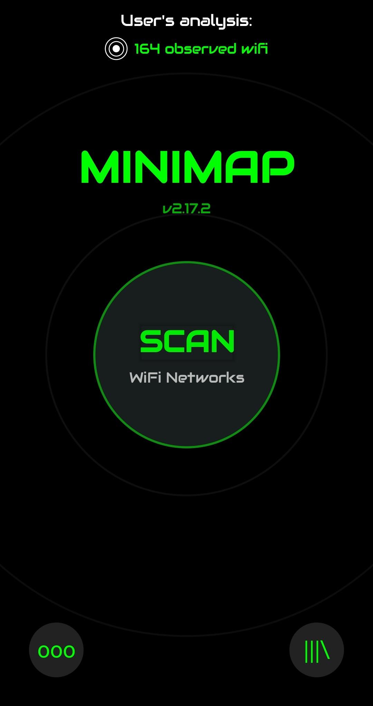
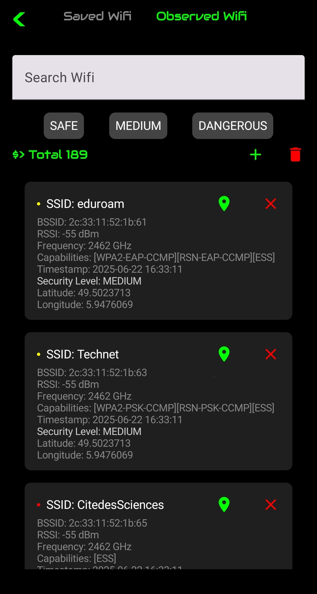
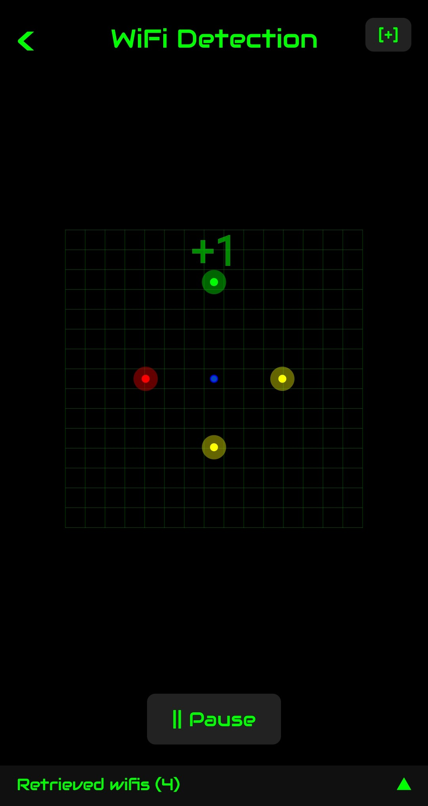

# MiniMap – Wi‑Fi Security Analyzer

> **MiniMap** is an Android application that passively scans nearby Wi‑Fi networks, predicts their security level with an on‑device machine‑learning model, and lets you store, visualise, and share the results.

---

## Table of contents

1. [Features](#features)
2. [Screenshots](#screenshots)
3. [Getting started](#getting-started)
4. [How it works](#how-it-works)
5. [Architecture](#architecture)
6. [Permissions](#permissions)
7. [License](#license)
8. [Acknowledgements](#acknowledgements)

---

## Features

| Category                       | Details                                                                                                                               |
| ------------------------------ | ------------------------------------------------------------------------------------------------------------------------------------- |
| **Live Wi‑Fi sonar**           | Periodically scans every 3 s and renders each network on a radar‑like canvas.                                                         |
| **ML‑powered security rating** | Custom TensorFlow Lite model classifies each network as **Safe · Medium · Dangerous** using SSID, capabilities, frequency, RSSI, etc. |
| **Timeline & history**         | Recent scans are stored locally (DataStore) and shown newest‑first.                                                                   |
| **JSON / CSV export**          | Save any scan to *JSON* or convert the full dataset to *CSV* for external analysis.                                                   |
| **Geo‑tagging**                | Records latitude / longitude and links directly to Google Maps.                                                                       |
| **Smart notifications**        | Optional background worker (15 min) warns when a *new* dangerous network is detected.                                                 |
| **Search & filters**           | Full‑text search + security‑level chips to slice large datasets.                                                                      |
| **Material 3 + Compose**       | Modern UI with smooth animations, dark theme, and adaptive design.                                                                    |

---

## Screenshots





---

## Getting started

### Prerequisites

* **Android Studio Flamingo** (or newer)
* Android SDK 33+
* A device or emulator running Android 8.0 (Oreo, API 26) or higher with Wi‑Fi support

### Build & run

```bash
# Clone the repo
$ git clone https://github.com/Fir3n0x/MiniMap.git
$ cd MiniMap

# Build and deploy the debug variant
$ ./gradlew installDebug
```

Or simply open the project in **Android Studio**, let it sync, and press Run button.

---

## How it works

1. **Scan** – `WifiManager.startScan()` captures raw information (SSID, BSSID, RSSI, frequency, capabilities, timestamp).
2. **Pre‑process** – Data is normalised and fed into a *TFLite* model (see \[`app/src/main/assets/model.tflite`]).
3. **Classify** – The model outputs a numeric class mapped to `SAFE`, `MEDIUM`, or `DANGEROUS`.
4. **Persist** – Results are stored in a local **DataStore** and duplicated to `wifis_dataset.csv` for bulk export.
5. **Visualise** – A custom `Canvas` renders networks as dots whose colour reflects their security level.

> **Passive only:** MiniMap never sends packets or associates to networks – it simply listens.

---

## Architecture

* **Language:** Kotlin 100 %
* **UI:** Jetpack Compose + Material 3
* **Asynchrony:** Kotlin Coroutines + Flow
* **ML:** TensorFlow Lite (float32), approx. 20 k params

---

## Permissions

| Permission                                         | Why it’s needed                                                                  |
| -------------------------------------------------- | -------------------------------------------------------------------------------- |
| `ACCESS_FINE_LOCATION`                             | Required by Android to receive Wi‑Fi scan results since API 26.                  |
| `ACCESS_WIFI_STATE` & `CHANGE_WIFI_STATE`          | Needed to start scans and read results.                                          |
| `POST_NOTIFICATIONS` (API 33+)                     | For optional security alerts.                                                    |
| `FOREGROUND_SERVICE`                               | Allows 15‑min background worker on Android 13+.                                  |
| `ACCESS_NETWORK_STATE`                             | Detect current connectivity and avoid unecessary scans/export.                   |
| `ACCESS_BACKGROUND_LOCATION`                       | Allow the periodic background worker to record coordinates.                      |
| `READ_EXTERNAL_STORAGE` & `WRITE_EXTERNAL_STORAGE` | Export JSON/CSV files to shared storage on legacy devices                        |
| `VIBRATE`                                          | Provide haptic feedback when discovering new network.                            |
| `WAKE_LOCK`                                        | Keep the CPU awake just long enough to finish a scan and trigger a notification. |

MiniMap requests permissions at runtime with a clear rationale and gracefully degrades if denied.

---

## Acknowledgements

* [Android Developers](https://developer.android.com/) docs – Wi‑Fi & ML Kit
* [TensorFlow Lite](https://www.tensorflow.org/lite) team
* Iconography by [Material Icons](https://fonts.google.com/icons)
* University of Luxembourg – *Principles of Software Development* course

---

### Author

**Corentin Mahieu** – [@Fir3n0x](https://github.com/Fir3n0x)

> This project started as a university assignment and has grown into a fully‑featured Wi‑Fi security companion. If you find it useful, ⭐ the repo and share your feedback!
